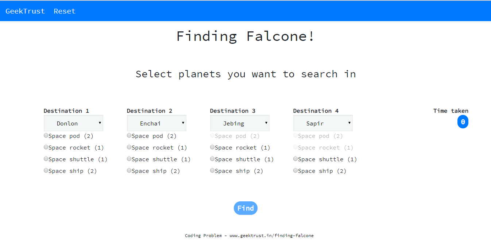

# find-falcone

## Available Scripts

In the project directory
first install all dependencies run following command

### `npm install`

To run the app in the development mode run following command

### `npm start`

Open [http://localhost:3000](http://localhost:3000) to view it in the browser.

To test the app run following command

### `npm test`

For Live [Demo](https://whoami-shubham.github.io/find-falcone/)
